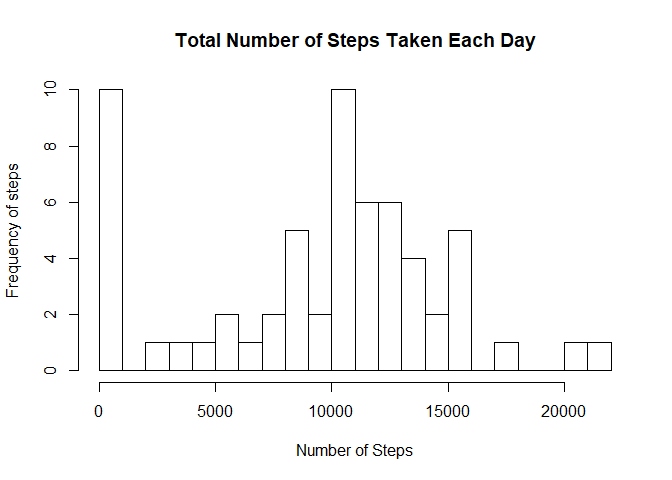
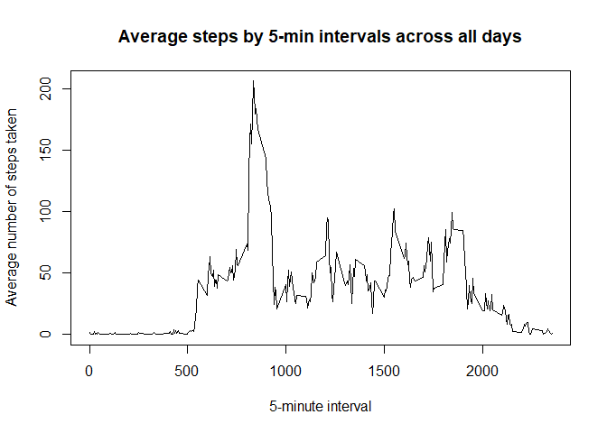
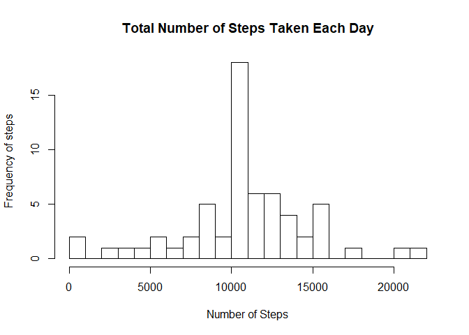
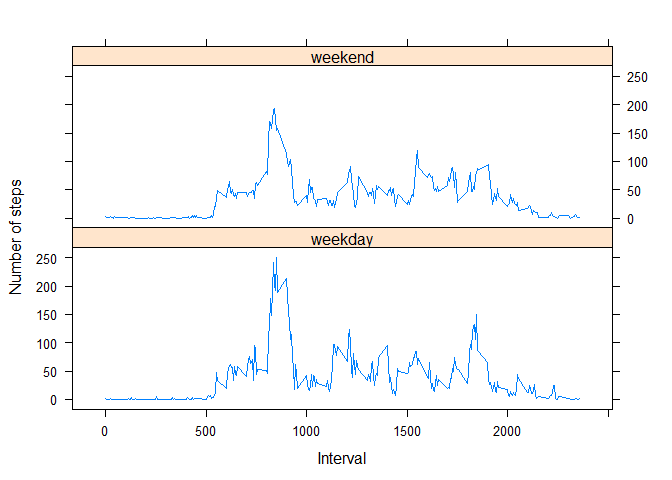

##  Loading and preprocessing the data

1.  Unzip the file and read data from file in local directory


```r
unzip(zipfile="repdata_data_activity.zip")
Activity <- read.csv("activity.csv")
```

2.  Format the date columns


```r
 Activity$date <- as.Date(Activity$date, format = "%Y-%m-%d")
```

##  What is mean total number of steps taken per day?

1.  Calculate the total number of steps taken per day


```r
TotStepsByDay <- aggregate(Activity$steps, list(Activity$date), sum, na.rm=TRUE)
names(TotStepsByDay)<-c("date","steps")
```
  
2.  Make a histogram of the total number of steps taken each day.


```r
hist(TotStepsByDay$steps,breaks = 20, main="Total Number of Steps Taken Each Day",ylab='Frequency of steps', xlab="Number of Steps")
```

<!-- -->

3.  Calculate and report the mean and median of the total number of steps taken per day


```r
mean(TotStepsByDay$steps, na.rm=TRUE)
```

```
## [1] 9354.23
```

```r
median(TotStepsByDay$steps, na.rm=TRUE)
```

```
## [1] 10395
```

##  What is the average daily activity pattern?

1.  Find the average steps per time period across dates


```r
AveStepsByInt <- aggregate(steps ~ interval, data=Activity, FUN="mean", na.rm=TRUE)

plot(AveStepsByInt$interval,AveStepsByInt$steps,type = "l",main="Average steps by 5-min intervals across all days",xlab="5-minute interval",ylab="Average number of steps taken")
```

<!-- -->

2.  Which 5-minute interval, on average across all the days in the dataset, contains the maximum number of steps?


```r
  AveStepsByInt[which.max(AveStepsByInt$steps),]
```

```
##     interval    steps
## 104      835 206.1698
```

##  Imputing missing values

1.  Calculate the number of missing values


```r
sum(is.na(Activity$steps))
```

```
## [1] 2304
```

2.  Fill in all of the missing values in the dataset with  use the mean/median for that day, or the mean for that 5-minute interval, etc


```r
  names(AveStepsByInt)[2] <- "average"
  ActivityImp <- merge(Activity,AveStepsByInt,,by="interval")
```

3.  Create a new dataset that is equal to the original dataset but with the missing data filled in.


```r
ActivityImp$steps[is.na(ActivityImp$steps)] <- ActivityImp$average[is.na(ActivityImp$steps)]
```

4.  Make a histogram of the total number of steps taken each day and calculate and report the mean and median total number of steps taken per day. Do these value differ from the estimates from the first part of the assignment? What is the impact of imputing missing data on the estimates of the total daily number of steps


```r
TotStepsByDayImp <- aggregate(ActivityImp$steps, list(ActivityImp$date), sum, na.rm=TRUE)
names(TotStepsByDayImp)<-c("date","steps")

hist(TotStepsByDayImp$steps,breaks = 20, main="Total Number of Steps Taken Each Day",ylab='Frequency of steps', xlab="Number of Steps")
```

<!-- -->

```r
mean(TotStepsByDayImp$steps, na.rm=TRUE)
```

```
## [1] 10766.19
```

```r
median(TotStepsByDayImp$steps, na.rm=TRUE)
```

```
## [1] 10766.19
```

After filling in the NA values, the mean and median are the same.

## Are there differences in activity patterns between weekdays and weekends?

1.  Create a new factor variable in the dataset with two levels - "weekday" and "weekend" indicating whether a given date is a weekday or weekend day.


```r
WeekDayEnd<-lapply(as.Date(ActivityImp$date), function(x) if (weekdays(x)<"Saturday") {return("weekday")} else {return("weekend")})
ActivityImp$day_type<-unlist(WeekDayEnd)
```

2.  Make a panel plot containing a time series plot (i.e. 
type = "l" of the 5-minute interval (x-axis) and the average number of steps taken, averaged across all weekday days or weekend days (y-axis). 


```r
AveStepsByIntImp <- aggregate(steps ~ interval+day_type, data=ActivityImp, FUN="mean", na.rm=TRUE)

library(lattice)
xyplot(steps ~ interval | day_type, data=AveStepsByIntImp, type = "l", layout = c(1, 2), xlab="Interval",ylab="Number of steps")
```

<!-- -->

The graphs show that number of steps are higher in the weekdays compared to weekends across most intervals.
